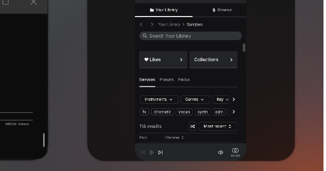

# SLICE

<p align="center">
  
</p>

<p align="center">
  
  <br>
  <em>SLICE Pad — click a slice to fire that channel's clip</em>
</p>


> **Splice gives you loops. SLICE writes the parts.**
> A pizza slice with a blade — open-source generative MIDI for Ableton Live,
> with AI subagents that know each track in your template.

---

## Why

Splice is a sample library. SLICE is an agent that **composes inside your session**.

- Sits in Ableton as a Max for Live device — a thin chat bar.
- Talks to a local Anthropic-powered bridge.
- Knows your template channels by name (KICK, SNARE, SUB, SYNTH 1-6, etc.).
- Each channel has a **memory-palace agent** with style knowledge + an OSC parameter whitelist.
- Animated cursor moves to the track Claude is editing.
- Slash-command dropdown (`/full`, `/fast`, `/cancel`, `/help`).
- Hex-encoded wire format — binary-safe payloads.

The sibling web app is called **CHOP**. Stay tuned.


## Devices

Two Max for Live devices ship together:

- **`device/ClaudeBar.amxd`** — thin chat bar. Type prompts, Claude executes via tools.
- **`device/SlicePad.amxd`** — pizza-wheel clip launcher. Each slice = one channel.
  Click a slice → bridge fires that channel's clip via AbletonOSC. Built-in chat too.

Drop either (or both) into your User Library MIDI Effects folder, then drag onto a MIDI track.

## What it does today

- Generates a 130 BPM dark-minor breakbeat across 10 channels in ~4 minutes
- Writes MIDI directly into existing template clip slots (no new tracks)
- Tweaks device parameters via AbletonOSC (per-channel whitelists keep things sane)
- Streams every tool call back to the bar in real time

## Architecture

```
┌─────────────────────┐     ┌──────────────────┐     ┌──────────────────┐
│  Max for Live       │     │  Collab-Hub      │     │  Claude Code CLI │
│  ClaudeBar.amxd     │◄───►│  socket.io       │◄───►│  --print stream  │
│   ├── jweb chat UI  │     │  127.0.0.1:3000  │     │  --allowed-tools │
│   └── claude_cursor.js     │  (localhost only)│     │  --session-id    │
└──────┬──────────────┘     └────────┬─────────┘     └────────┬─────────┘
       │                             │                        │
       └─────────── hex-encoded control messages ─────────────┘
                              │
                              ├─→ ableton-mcp  (clip + note authoring)
                              └─→ osc.py       (AbletonOSC params + locators)
```

## Install

Requires:
- Ableton Live 12.x + Max for Live
- Python 3.10+ with `anthropic`, `python-socketio[client]`, `eventlet`
- Claude Code CLI (`npm i -g @anthropic-ai/claude-code`)
- Anthropic API key in `~/.env` as `ANTHROPIC_API_KEY=sk-ant-...`
- [AbletonOSC](https://github.com/ideoforms/AbletonOSC) installed and enabled as a Control Surface

```bash
# 1. Clone
git clone https://github.com/YOUR/slice.git && cd slice

# 2. Python deps
pip install anthropic "python-socketio[client]" eventlet

# 3. Start local Collab-Hub relay (localhost only)
python bridge/server.py &

# 4. Start the bridge
python bridge/bridge.py &

# 5. Generate channel agents from the included template
python agents/build.py

# 6. Drop ClaudeBar.amxd onto a MIDI track in Ableton
#    (copy device/ClaudeBar.amxd into your User Library first)
```

## Use

Type into the chat bar. Default mode is `/fast` (Haiku, instant chat).
Switch to `/full` for Sonnet + tools when you want it to actually move things in Live.

Slash commands:
- `/help`              — list commands
- `/fast` / `/full`    — switch model + tool access
- `/cancel`            — kill the running job
- `/reset`             — clear history
- `/tracks`            — list session tracks
- `/tempo 124`         — set tempo
- `/play` / `/stop`    — transport

## The agents

`agents/presets/` ships 24 memory-palace agents — one per channel in the included template.
Each agent has 5 anchored rooms:

- **North wall** — your channel name + lookup-by-name workflow
- **East wall** — what instrument is loaded + don't-touch rules
- **South wall** — OSC parameter whitelist with safe min/max + discovery commands
- **West wall** — section-by-section MIDI patterns (INTRO/BUILD/DROP/BREAKDOWN/DROP 2/OUTRO)
- **Ceiling** — universal hard rules

Want different channels? Edit `agents/build.py` and re-run.

## Cost cuts

Sonnet 4.6 + 374 tool schemas re-sent every spawn = expensive. SLICE applies:
- `--allowed-tools` — only 9 ableton-mcp tools + Task/Bash/file ops (~80% schema reduction)
- `--session-id` — fresh UUID per spawn (session lock-free)
- Default `/fast` mode (Haiku) for chat
- `/full` (Sonnet) only when actually editing Ableton

Real session cost generating a 10-channel breakbeat: under $0.50.

## License

MIT. Use it, fork it, slice it.

## Status

Alpha. Built in a day. Things will break.

- See `docs/` for setup notes and known issues
- See `chop/` for the sibling web app (placeholder)
- See `screenshots/` for visuals (TBD)
